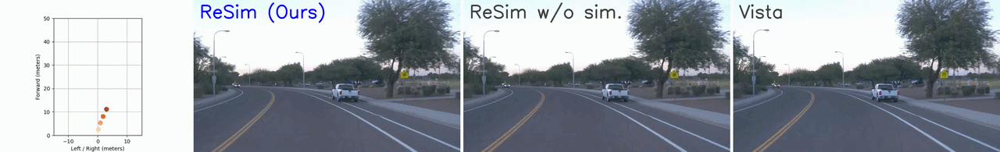
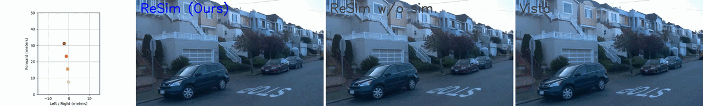

# ReSim

The official implementation of our **NeurIPS 2025 Spotlight** paper:

**ReSim: Reliable World Simulation for Autonomous Driving**





> [Jiazhi Yang](https://jiazyang.github.io/),
> [Kashyap Chitta](https://kashyap7x.github.io/),
> [Shenyuan Gao](https://github.com/Little-Podi),
> [Long Chen](https://long.ooo/),
> [Yuqian Shao](https://meteorcollector.github.io/),
> [Xiaosong Jia](https://jiaxiaosong1002.github.io/),
> [Hongyang Li](https://lihongyang.info/),
> [Andreas Geiger](https://www.cvlibs.net/),
> [Xiangyu Yue](https://xyue.io/),
> [Li Chen](https://ilnehc.github.io/)
>
> [[arXiv](https://arxiv.org/abs/2506.09981)],
> [[project page and video demos](https://opendrivelab.com/ReSim)]
>
> Primary contact: Jiazhi Yang, jzyang@link.cuhk.edu.hk


## Highlights

**ReSim** is a driving world model for reliable simulation of future ego-view
driving videos under a wide range of ego behaviors.

- **Reliable action control.** ReSim supports action-conditioned future
  prediction for expert, free-driving, commanded, and hazardous non-expert
  behaviors.
- **Heterogeneous training data.** The model is trained from a mixture of web
  driving videos, real driving datasets with action or trajectory labels, and
  simulated data containing non-expert behavior.
- **High-fidelity open-world prediction.** ReSim targets realistic future
  driving video generation while improving controllability for both expert and
  non-expert actions.

## News

- **[2026/05/05]** Initial public code release.

## TODO List

- [ ] Release pretrained ReSim world-model weights.

- [ ] Initial code release with training and inference scripts.

## Getting Started

- [Installation](#installation)
- [Checkpoint Preparation](#checkpoint-preparation)
- [Data Preparation](#data-preparation)
- [Training](#training)
- [Inference](#inference)
- [Trouble Shooting](#trouble-shooting)

## Repository Layout

```text
.
|-- sat/                    # ReSim world-model training and inference code
|   |-- configs/            # Example training and inference configs
|   |-- sgm/                # Diffusion, conditioning, sampling, and VAE modules
|   |-- train_video.py      # Training entrypoint
|   `-- sample_video.py     # Inference entrypoint
|-- inference/              # Upstream text-to-video demos for dependency checks
|-- tools/                  # Weight conversion and captioning utilities
|-- SwissArmyTransformer/   # Vendored SAT dependency used by ReSim
`-- requirements.txt        # Runtime and ReSim world-model dependencies
```

## Installation

The main ReSim pipeline was developed with Python 3.10, PyTorch 2.4, CUDA 12.4,
SAT, and DeepSpeed-style distributed training.

```bash
conda create -n resim python=3.10 -y
conda activate resim

pip install torch==2.4.0 torchvision==0.19.0 --index-url https://download.pytorch.org/whl/cu124
pip install -r requirements.txt

cd SwissArmyTransformer
pip install -e .
cd ..
```

The launch scripts under `sat/` also add the vendored `SwissArmyTransformer`
directory to `PYTHONPATH`, so inference can run from a clean checkout after the
Python dependencies are installed.

## Checkpoint Preparation

ReSim uses SAT-format video diffusion checkpoints plus the text encoder and VAE
components required by the configs. A typical ReSim checkpoint bundle looks like:

```text
checkpoints/
|-- transformer/
|   |-- latest
|   `-- <iteration>/mp_rank_00_model_states.pt
|-- vae/3d-vae.pt
`-- t5-v1_1-xxl/
    |-- config.json
    |-- model-00001-of-00002.safetensors
    |-- model-00002-of-00002.safetensors
    |-- model.safetensors.index.json
    |-- spiece.model
    `-- tokenizer_config.json
```

Before running training or inference, copy an example config and update:

- `args.load`: ReSim or base transformer checkpoint directory.
- `model.conditioner_config...FrozenT5Embedder.params.model_dir`: T5 directory.
- `model.first_stage_config.params.ckpt_path`: VAE checkpoint path.
- `args.train_data` and `args.valid_data`: dataset annotation files.

## Data Preparation

The ReSim loaders are JSON-driven. Real driving and simulator datasets use the
shared schema consumed by `sat/data_share.py`:

```json
{
  "meta": {
    "data_root": "/path/to/image/root"
  },
  "clips": [
    {
      "img_seq": ["scene/frame_000.jpg", "scene/frame_001.jpg"],
      "cmd": "Moving_Forward",
      "traj_fut": [[0.0, 0.0, 0.0], [1.0, 0.1, 0.0]],
      "lidar_pc_token": "sample-token"
    }
  ]
}
```

Important fields:

- `img_seq` is a list of frame paths relative to `meta.data_root`. The loader
  also supports `img_seq_his` plus `img_seq_fut`.
- `cmd` can be a string such as `Moving_Forward`, `Turning_Left`, or
  `Turning_Right`, or an integer mapped by `sat/data_utils.py`.
- `traj_fut` stores future trajectory points as `[x, y, heading]`. The default
  configs use 8 future points.
- `lidar_pc_token` or `token` is used to name generated outputs.

For web-driving data, `sat/data_youtube.py` expects clips with `folder_name`,
`first_frame`, `end_frame`, and `flow_direction`.

## Training

Run ReSim training through `sat/train_video.py` and the provided launcher:

```bash
cd sat

# CFG, GPUS, NNODES, optional SEED
bash finetune_multi_gpus_custom.sh configs/main5_joint_stage2_high_small-lr_full.yaml 8 1 42
```

For single-GPU debugging:

```bash
cd sat
bash finetune_single_gpu_custom.sh configs/main5_joint_stage2_high_small-lr_full.yaml
```

Before launching a real run, check the copied config:

- `args.mode: finetune`
- `data.target`, for example `data_multi.MultiSourceDataset` or
  `data_waymo.WaymoDataset`
- `data.params.video_size`, `fps`, `max_num_frames`, and crop mode
- DeepSpeed batch size, gradient accumulation, precision, and save interval
- `train_data_weights` when mixing heterogeneous data sources

Training writes checkpoints under `args.save` and stores the merged training
config with the run.

## Inference

Run ReSim sampling through `sat/sample_video.py` and the provided launcher:

```bash
cd sat
bash inference_custom.sh configs/infer_nus_new.yaml
```

The example inference config uses `input_type: dataset`; it loads validation
clips, conditions on the first frames, optionally applies `fut_traj`, and writes
MP4 samples.

Common inference options are config-driven:

- `args.sampling_video_size`: output frame size, for example `[512, 896]`.
- `args.sampling_num_frames`: latent-frame count, commonly `13`, `11`, or `9`.
- `args.n_prediction_round`: autoregressive rollout rounds.
- `args.apply_traj`: whether to condition on `fut_traj`.
- `args.save_gt` and `args.concat_gt_for_demo`: whether to save ground-truth
  clips and side-by-side demo videos.

## Trouble Shooting

- `ModuleNotFoundError: No module named 'sat'`: install the vendored SAT package
  with `pip install -e SwissArmyTransformer`.

- Paths in example configs must be
  replaced with paths on your machine before running.


## Acknowledgement

This implementation builds on the SAT training stack from
[CogVideoX](https://github.com/zai-org/CogVideo),
[SwissArmyTransformer](https://github.com/THUDM/SwissArmyTransformer), and
other open-source video diffusion components. We thank all maintainers for
their open-source contributions.


## Citation

If this project is useful for your research, please cite:

```bibtex
@inproceedings{yang2025resim,
  title={ReSim: Reliable World Simulation for Autonomous Driving},
  author={Jiazhi Yang and Kashyap Chitta and Shenyuan Gao and Long Chen and Yuqian Shao and Xiaosong Jia and Hongyang Li and Andreas Geiger and Xiangyu Yue and Li Chen},
  booktitle={Advances in Neural Information Processing Systems (NeurIPS)},
  year={2025}
}
```

## License

The repository includes an Apache-2.0 `LICENSE` file. Model weights may be
governed by separate terms in `MODEL_LICENSE`. Check the licenses of SAT, CARLA,
nuScenes, Waymo, nuPlan, OpenDV, and any redistributed annotations before public
release or commercial use.
